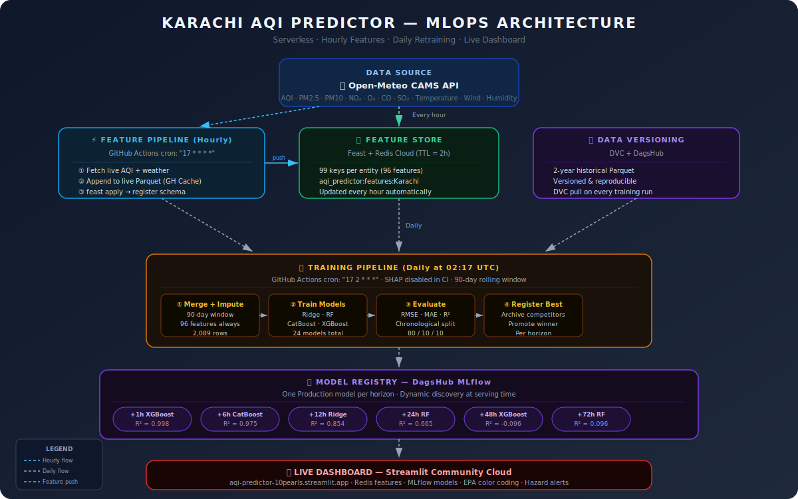

# 🌬️ Karachi AQI Predictor — MLOps Pipeline

[](https://github.com/TalhaArsh/aqi-predictor/actions/workflows/feature_pipeline.yml)
[](https://github.com/TalhaArsh/aqi-predictor/actions/workflows/training_pipeline.yml)
[](https://aqi-predictor-10pearls.streamlit.app/)
[](https://dagshub.com/TalhaArsh/aqi-predictor.mlflow)
[](https://python.org)
[](https://deepwiki.com/TalhaArsh/aqi-predictor)

> **Production-grade MLOps system forecasting Karachi's Air Quality Index 1h–72h ahead.**
> Built as a capstone project for the 10Pearls Shine Program 2026.

### 🔗 Links
**[Live Dashboard](https://aqi-predictor-10pearls.streamlit.app/)** · **[MLflow Experiments](https://dagshub.com/TalhaArsh/aqi-predictor.mlflow)** · **[DagsHub Repository](https://dagshub.com/TalhaArsh/aqi-predictor)**

---

## 📋 Table of Contents
- [Introduction](#-introduction)
- [System Architecture](#-system-architecture)
- [Key Features](#-key-features)
- [How It Works](#️-how-it-works)
- [Model Performance](#-model-performance)
- [Project Structure](#-project-structure)
- [Setup & Usage](#-setup--usage)
- [Key Findings](#-key-findings)

---

## 📝 Introduction

Karachi consistently ranks among the world's most polluted cities. This project delivers a **fully automated MLOps pipeline** that forecasts Air Quality Index (AQI) for Karachi, Pakistan across 6 time horizons — from 1 hour to 72 hours ahead.

The system automatically ingests live air quality and weather data every hour, retrains four competing machine learning models daily, selects the best performer per horizon, and serves real-time forecasts through a live Streamlit dashboard — all without manual intervention.

---

## 🏗️ System Architecture



---

## ✨ Key Features

- **Automated hourly data pipeline** — fetches AQI + weather from Open-Meteo CAMS (no API key required)
- **Feast + Redis Cloud feature store** — online features with 2-hour TTL, 99 keys per entity
- **DVC + DagsHub** — 2-year historical Parquet versioned and reproducible
- **4-family model comparison** — Ridge, Random Forest, CatBoost, XGBoost × 6 horizons = 24 models
- **90-day rolling training window** — captures current seasonal patterns, avoids concept drift
- **Automatic champion selection** — best test RMSE per horizon promoted to MLflow Production
- **Live Streamlit dashboard** — EPA category color coding, hazard alerts, confidence indicators
- **Full CI/CD via GitHub Actions** — hourly feature + daily training pipelines

---

## ⚙️ How It Works

### 1. Hourly Feature Pipeline

Triggered every hour by GitHub Actions (`cron: "17 * * * *"`):

1. Fetch latest AQI + weather from Open-Meteo CAMS API
2. Append to live Parquet (stored in GitHub Actions Cache)
3. Push 99 features to Redis Cloud (TTL = 2 hours)
4. Register feature schema via `feast apply`

### 2. Daily Training Pipeline

Triggered every day at 02:17 UTC (`cron: "17 2 * * *"`):

1. Pull 2-year historical Parquet from DagsHub via DVC
2. Restore live Parquet from GitHub Actions Cache
3. Merge → deduplicate → **apply 90-day rolling window**
4. Engineer 96 features (lags, rolling means, change features, time cyclicals)
5. Train **Ridge · Random Forest · CatBoost · XGBoost** — all 6 horizons
6. Archive competing Production models, promote best per horizon to MLflow registry
7. Dashboard auto-loads new Production models on next refresh

---

## 📊 Model Performance

> Evaluated on chronological 80/10/10 train/val/test split · 90-day rolling window · 2,089 rows · 96 features

| Horizon | Model | RMSE | MAE | R² | Confidence |
|:---:|:---:|:---:|:---:|:---:|:---:|
| **+1h** | XGBoost | 0.76 | 0.45 | **0.998** | ✅ High |
| **+6h** | CatBoost | 2.71 | 2.02 | **0.975** | ✅ High |
| **+12h** | Ridge | 6.85 | 5.59 | **0.854** | ✅ High |
| **+24h** | Random Forest | 10.92 | 6.62 | **0.665** | ⚠️ Medium |
| **+48h** | XGBoost | 15.21 | 12.53 | -0.096 | ⚠️ Low |
| **+72h** | Random Forest | 9.82 | 7.57 | 0.096 | ⚠️ Low |

**Dataset:** Karachi, Pakistan (24.86°N, 67.00°E) · AQI range 32–161 · Mean AQI 80 (Moderate)

---

## 📁 Project Structure

```
aqi-predictor/
├── .github/workflows/
│   ├── feature_pipeline.yml     # Hourly: fetch → Parquet → Redis
│   └── training_pipeline.yml    # Daily: merge → impute → train → register
│
├── feature_store/
│   ├── feature_store.yaml       # Feast config (Redis Cloud)
│   └── features.py              # 6 feature views, 96 features
│
├── src/
│   ├── feature_pipeline.py      # Live data fetch + Redis push
│   ├── feast_utils.py           # Direct Redis read/write
│   ├── impute_features.py       # 96-feature engineering pipeline
│   ├── backfill_pipeline.py     # 2-year historical backfill
│   └── training/
│       ├── data_loader.py       # Loads cleaned Parquet
│       ├── train_ridge.py       # Ridge regression
│       ├── train_rf.py          # Random Forest
│       ├── train_catboost.py    # CatBoost (categorical features)
│       ├── train_xgboost.py     # XGBoost (sample weights)
│       └── register_best.py    # Promotes best model → MLflow Production
│
├── dashboard/
│   ├── app.py                   # Streamlit dashboard
│   └── requirements.txt         # Pinned dependencies
│
├── data/
│   ├── raw/aqi_features_historical.parquet   # 2yr history (DVC tracked)
│   └── interim/aqi_features_cleaned.parquet  # 90-day engineered features
│
├── System_Architecture.png      # Architecture diagram
├── check_redis.py               # Redis verification utility
└── .python-version              # Python 3.11
```

---

## 🚀 Setup & Usage

### Prerequisites
- Python 3.11, Redis Cloud account, DagsHub account

### Install

```bash
git clone https://github.com/TalhaArsh/aqi-predictor.git
cd aqi-predictor
python -m venv .venv && source .venv/bin/activate
pip install -r dashboard/requirements.txt
pip install feast[redis] dvc[http]
```

### Environment Variables (`.env`)

```env
DAGSHUB_USERNAME=TalhaArsh
DAGSHUB_TOKEN=your_dagshub_token
MLFLOW_TRACKING_URI=https://dagshub.com/TalhaArsh/aqi-predictor.mlflow
REDIS_HOST=your_redis_host
REDIS_PORT=16572
REDIS_PASSWORD=your_redis_password
```

### Run Locally

```bash
python -m src.feature_pipeline    # Populate Redis with live features
python check_redis.py             # Verify Redis connection
streamlit run dashboard/app.py    # Launch dashboard
```

---

## 🔑 Key Findings

**1. Delta framing beats direct prediction**
Predicting `aqi[t+h] - aqi[t]` (change) vs `aqi[t+h]` (absolute) yields dramatically better R² — e.g. +1h: **0.998 vs 0.901**.

**2. Feature column order is critical**
`StandardScaler` applies scaling by column position. Sending features in the wrong order produces garbage predictions (+669 delta). Fixed by reading `scaler.feature_names_in_` from each model at inference time.

**3. 90-day window beats 2-year window**
Short training window captures recent seasonal patterns without concept drift — +6h R² improves from 0.803 → **0.975**.

**4. Long-horizon limits**
48h and 72h R² is near zero without weather forecast integration — shown with `~` prefix and dimmed opacity in dashboard as a transparency measure.

---

## 👤 Author

**Talha Arsh** · 10Pearls Shine Program 2026 · Data Science Track

[](https://linkedin.com/in/talhaarsh)

---

*Data: Open-Meteo CAMS (free, no API key) · Models: DagsHub MLflow · Dashboard: Streamlit Community Cloud*
